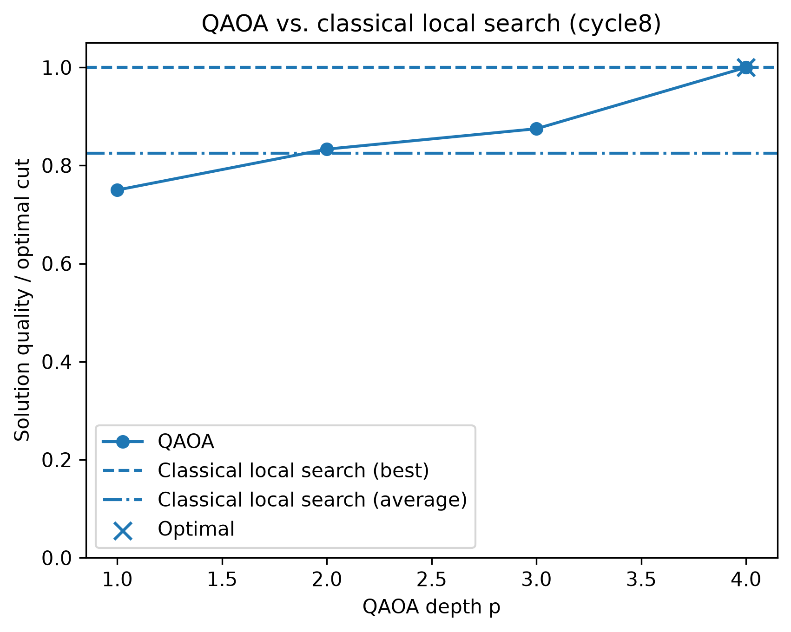
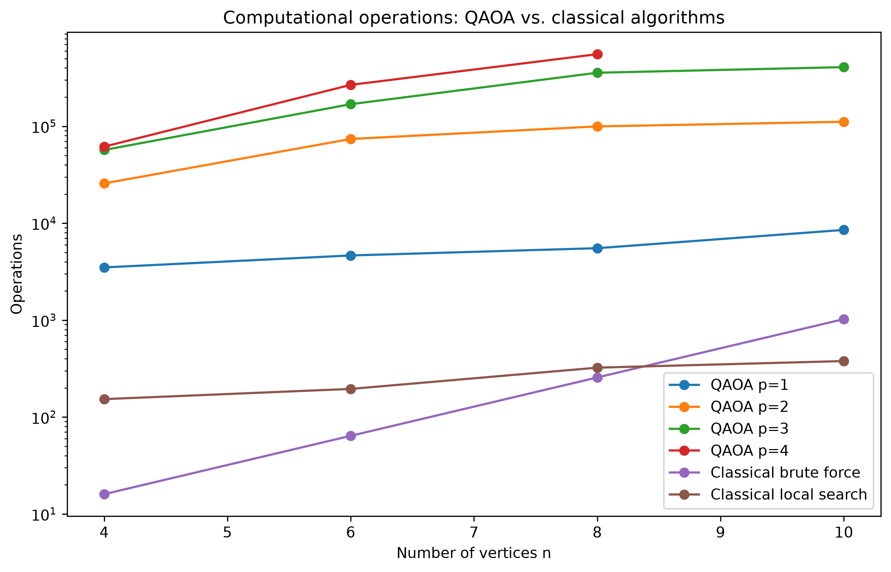
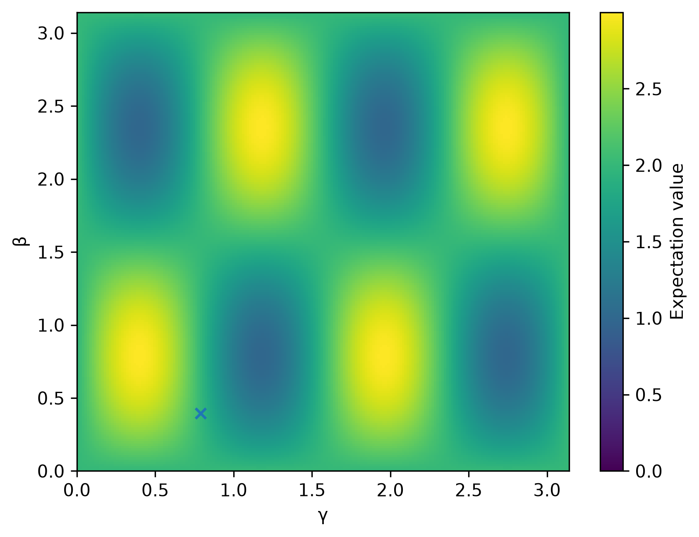
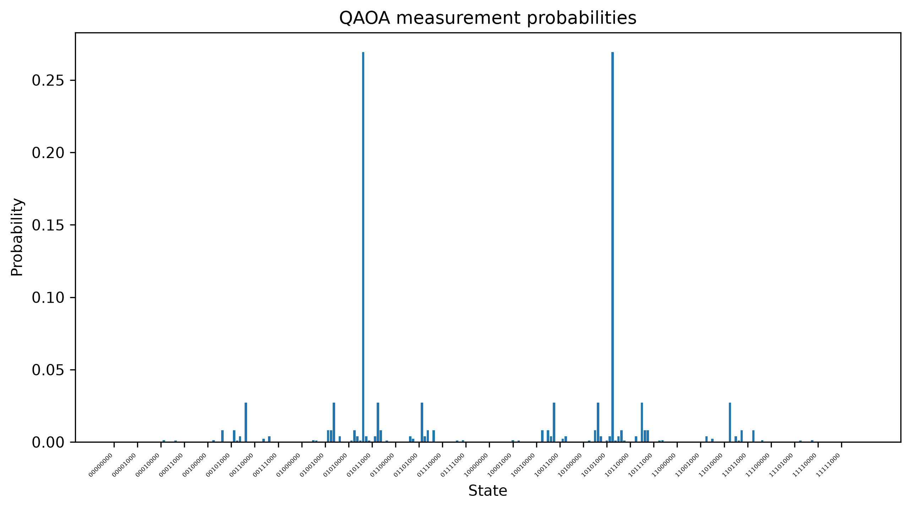

# QAOA-MaxCut

A Python implementation of the Quantum Approximate Optimization Algorithm (QAOA) applied to the Max-Cut problem.

The project was built to explore quantum algorithms in practice and compare their computational cost with classical approaches.

## Results

### Solution quality

  

QAOA approaches the optimal solution as the circuit depth \(p\) increases. For the small cycle graphs tested, classical local search reaches the optimum more efficiently.

### Computational cost

  

The QAOA circuit itself uses a relatively small number of quantum gates, but parameter optimization requires many circuit evaluations. The classical brute-force method grows exponentially with problem size.

  

The parameter landscape illustrates how the choice of $\gamma$ and $\beta$ affects the QAOA expectation value.

### Measurement probabilities

  

The final state distribution shows how probability is concentrated around high-quality Max-Cut solutions.

## Implementation

- QAOA implemented from scratch in Python
- Quantum-state simulation using NumPy
- Parameter optimization using SciPy
- Classical brute-force and local-search baselines
- Measurement and visualization of quantum states
- Operation and quantum-gate counting
- Unit tests for core components

## Project structure

    experiments/   Experiments and plotting
    src/           QAOA and Max-Cut implementation
    tests/         Unit tests
    results/       Experimental results
    figures/       Generated plots

## Acknowledgements

The classical local-search heuristic is based on the implementation described in [State-flipping algorithm for Max-Cut](https://gist.github.com/3694491), with minor adaptations to the graph representation used in this project.